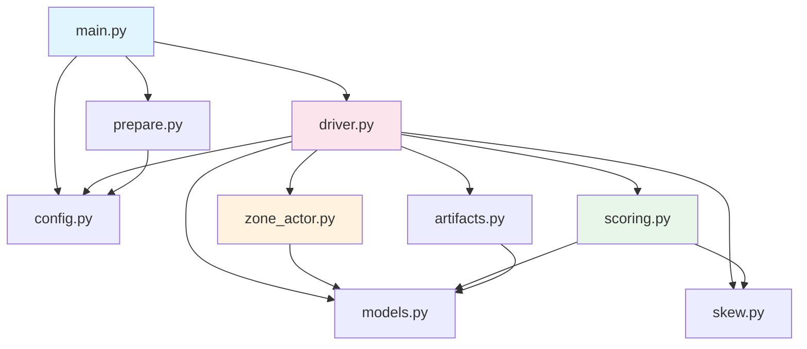
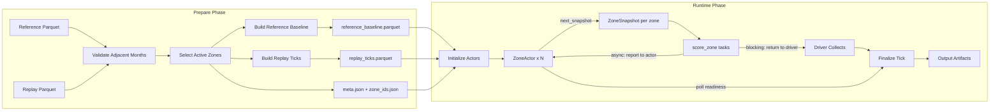
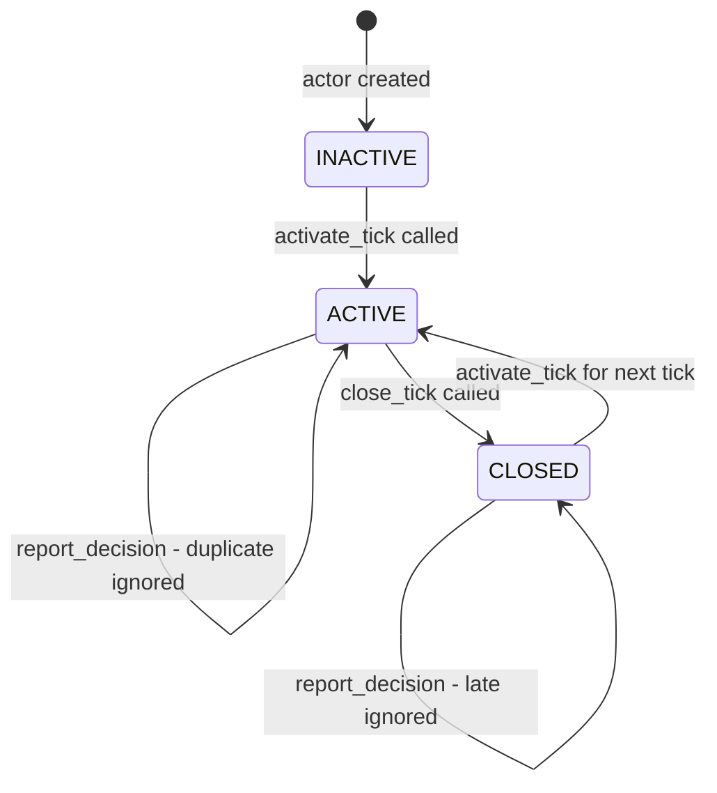

# Architecture Plan — TLC-backed Per-Zone Recommendations Under Skew

> **Single source of truth** for all implementation subtasks.
> Implements the design specified in [`design_doc.md`](design_doc.md).
> Extends the CLI scaffold in [`main.py`](main.py).

---

## Table of Contents

1. [File Layout](#1-file-layout)
2. [Module Dependency Graph](#2-module-dependency-graph)
3. [Data Flow](#3-data-flow)
4. [Data Models and Type Signatures](#4-data-models-and-type-signatures)
5. [ZoneActor State Machine](#5-zoneactor-state-machine)
6. [Driver Loop Pseudocode](#6-driver-loop-pseudocode)
7. [Scoring Logic](#7-scoring-logic)
8. [Skew Injection](#8-skew-injection)
9. [Artifact Schemas](#9-artifact-schemas)
10. [Configuration](#10-configuration)
11. [Testing Strategy](#11-testing-strategy)
12. [Implementation Sequence](#12-implementation-sequence)

---

## 1. File Layout

All files live under `Ray/4_ray_capstone_project/`.

```
Ray/4_ray_capstone_project/
├── main.py                  # CLI entry point (existing scaffold — preserved)
├── config.py                # RunConfig dataclass, defaults, serialization
├── prepare.py               # Data preprocessing: validate, aggregate, write assets
├── zone_actor.py            # ZoneActor @ray.remote class
├── scoring.py               # score_zone @ray.remote function + decision logic
├── driver.py                # Driver loop: run_blocking, run_async, run_stress
├── models.py                # Shared data models: ZoneSnapshot, TickResult, etc.
├── artifacts.py             # Artifact writers: metrics.csv, latency_log.json, etc.
├── skew.py                  # Skew injection: slow-zone selection and sleep
├── test_prepare.py          # Tests for data preprocessing
├── test_scoring.py          # Tests for scoring determinism and edge cases
├── test_actor.py            # Tests for ZoneActor idempotency invariants
├── test_driver.py           # Integration tests for blocking/async driver loops
├── architecture_plan.md     # This file
├── design_doc.md            # Original design specification (existing)
└── README.md                # Setup, run commands, decision rule explanation
```

### Prepared assets directory (written by `prepare` command)

```
prepared/
├── meta.json                # n_zones, tick_minutes, zone_ids, date range, seed
├── reference_baseline.parquet   # (zone_id, hour_of_day, day_of_week) → stats
├── replay_ticks.parquet     # (zone_id, tick_id, tick_start, pickup_count)
└── zone_ids.json            # ordered list of active zone IDs
```

### Run output directory (written by `run` command)

```
output/<mode>_<timestamp>/
├── run_config.json          # Full config snapshot
├── metrics.csv              # Per-tick metrics
├── latency_log.json         # Per-zone per-tick task latency
└── tick_summary.json        # Aggregated tick-level summary
```

---

## 2. Module Dependency Graph



**Import rules:**
- `models.py` imports nothing from the project (leaf module)
- `config.py` imports nothing from the project (leaf module)
- `skew.py` imports only `config.py`
- `scoring.py` imports `models.py` and `skew.py`
- `zone_actor.py` imports `models.py`
- `artifacts.py` imports `models.py`
- `driver.py` imports everything except `prepare.py`
- `prepare.py` imports only `config.py`
- `main.py` imports `prepare.py`, `driver.py`, `config.py`

---

## 3. Data Flow



### Prepare Phase — Detailed Steps

1. **Load** both parquet files via `pd.read_parquet()`
2. **Validate** adjacency: extract year/month from `lpep_pickup_datetime`, confirm months differ by exactly 1 and years match (handling Dec→Jan wrap)
3. **Select active zones**: group reference month by `PULocationID`, sum pickup counts, sort descending, take top-N (configurable, default 8), break ties by zone ID for determinism, use `seed` for any random operations
4. **Build reference baseline**: filter reference to active zones, floor `lpep_pickup_datetime` to 15-min ticks, extract `hour_of_day` and `day_of_week`, group by `(zone_id, hour_of_day, day_of_week)`, compute `mean_pickups` and `std_pickups`
5. **Build replay ticks**: filter replay to active zones, floor `lpep_pickup_datetime` to 15-min ticks, assign sequential `tick_id` (0-based), group by `(zone_id, tick_id)`, count pickups, fill missing `(zone, tick)` pairs with 0
6. **Cross-check**: pick a sample window (e.g., first 10 ticks), recompute counts directly from raw replay data, assert equality with prepared replay table
7. **Write** all assets to `prepared/` directory

### Runtime Phase — Detailed Steps

1. **Load** prepared assets from `prepared/`
2. **Initialize** one `ZoneActor` per active zone, passing zone-specific replay partition and reference baseline via `ray.put()`
3. **Loop** over ticks: for each tick_id in replay range:
   - Mark tick active on all actors
   - Collect snapshots from all actors
   - Launch scoring tasks
   - Finalize tick (mode-dependent)
   - Close tick on all actors
   - Record metrics
4. **Write** output artifacts

---

## 4. Data Models and Type Signatures

### `models.py` — Shared Data Structures

```python
from __future__ import annotations
from dataclasses import dataclass, field, asdict
from typing import Literal

Decision = Literal["NEED", "OK"]
FallbackPolicy = Literal["previous_else_ok", "always_previous"]
TickState = Literal["INACTIVE", "ACTIVE", "CLOSED"]


@dataclass(frozen=True)
class ZoneSnapshot:
    """Immutable snapshot sent from ZoneActor to score_zone task."""
    zone_id: int
    tick_id: int
    tick_start: str                    # ISO-8601 timestamp
    hour_of_day: int                   # 0-23
    day_of_week: int                   # 0=Monday, 6=Sunday
    current_demand: int                # pickup count this tick
    recent_demands: tuple[int, ...]    # last K tick demands (sliding window)
    baseline_mean: float               # reference mean for this hour/dow
    baseline_std: float                # reference std for this hour/dow
    is_slow_zone: bool                 # whether skew is injected


@dataclass(frozen=True)
class ScoringResult:
    """Output of score_zone task — returned to driver or reported to actor."""
    zone_id: int
    tick_id: int
    decision: Decision
    score: float                       # raw z-score or ratio
    task_latency_s: float              # wall-clock time of scoring task
    skew_sleep_s: float                # artificial delay applied (0.0 if none)


@dataclass
class TickMetrics:
    """Per-tick metrics collected by the driver."""
    tick_id: int
    tick_start: str
    mode: str
    n_zones: int
    n_completed: int                   # zones that finished before finalization
    n_fallback: int                    # zones that used fallback policy
    n_late: int                        # late reports ignored (async only)
    n_duplicate: int                   # duplicate reports ignored (async only)
    mean_latency_s: float
    max_latency_s: float
    skew_ratio: float                  # max / mean latency
    tick_wall_s: float                 # total wall-clock for this tick


@dataclass
class ZoneTickLatency:
    """Per-zone per-tick latency entry for latency_log.json."""
    zone_id: int
    tick_id: int
    task_latency_s: float
    skew_sleep_s: float
    decision: Decision
    used_fallback: bool
    was_late: bool                     # True if result arrived after finalization
```

### `config.py` — Runtime Configuration

```python
from __future__ import annotations
from dataclasses import dataclass, field, asdict
import json
from pathlib import Path


@dataclass
class RunConfig:
    """Full runtime configuration — serialized to run_config.json."""
    mode: str                                  # "blocking" | "async" | "stress"
    n_zones: int = 8
    tick_minutes: int = 15
    max_inflight_zones: int = 4
    tick_timeout_s: float = 2.0
    completion_fraction: float = 0.75
    slow_zone_fraction: float = 0.25
    slow_zone_sleep_s: float = 1.0
    fallback_policy: str = "previous_else_ok"  # "previous_else_ok" | "always_previous"
    seed: int = 42
    ray_address: str | None = None

    def to_json(self, path: Path) -> None:
        path.write_text(json.dumps(asdict(self), indent=2))

    @classmethod
    def from_args(cls, args) -> RunConfig:
        """Build RunConfig from argparse Namespace."""
        ...

    @classmethod
    def stress_override(cls, base: RunConfig) -> RunConfig:
        """Return a copy with harsher skew parameters for stress mode."""
        ...
```

### `zone_actor.py` — ZoneActor Signatures

```python
@ray.remote
class ZoneActor:
    def __init__(
        self,
        zone_id: int,
        replay_partition: pd.DataFrame,    # rows for this zone from replay_ticks
        reference_baseline: pd.DataFrame,  # rows for this zone from reference_baseline
        config: RunConfig,
    ) -> None: ...

    def activate_tick(self, tick_id: int) -> None:
        """Mark tick_id as the current active tick. Resets per-tick state."""
        ...

    def next_snapshot(self, tick_id: int) -> ZoneSnapshot:
        """Build and return the snapshot for the current tick."""
        ...

    def report_decision(
        self, tick_id: int, result: ScoringResult
    ) -> Literal["accepted", "duplicate", "late", "rejected"]:
        """Async mode: scoring task reports its result to the actor.
        Returns status string for observability."""
        ...

    def write_decision(
        self, tick_id: int, decision: Decision, score: float,
        used_fallback: bool = False,
    ) -> Literal["accepted", "duplicate"]:
        """Blocking mode: driver writes the accepted decision.
        Idempotent by (zone_id, tick_id)."""
        ...

    def close_tick(
        self, tick_id: int, fallback_policy: str
    ) -> None:
        """Finalize the tick. If no decision was reported, apply fallback."""
        ...

    def get_tick_status(self, tick_id: int) -> dict:
        """Poll whether this actor has a decision for tick_id.
        Returns {has_decision: bool, decision: str|None, tick_state: str}."""
        ...

    def get_decision_history(self) -> dict[int, dict]:
        """Return full keyed history of accepted decisions by tick_id."""
        ...

    def get_counters(self) -> dict:
        """Return observability counters: duplicates, late, fallbacks."""
        ...
```

### `scoring.py` — Scoring Task Signature

```python
@ray.remote
def score_zone(
    snapshot: ZoneSnapshot,
    actor_handle: ray.actor.ActorHandle | None = None,
) -> ScoringResult:
    """Score a single zone for one tick.

    In blocking mode: actor_handle is None, result returned to driver.
    In async mode: actor_handle is provided, result reported to actor,
                   then also returned (for driver latency tracking).

    Deterministic from snapshot input. Retry-safe.
    """
    ...
```

### `driver.py` — Driver Function Signatures

```python
def run_blocking(
    prepared_dir: Path, output_dir: Path, config: RunConfig
) -> None:
    """Blocking driver loop. Waits for all zone results per tick."""
    ...

def run_async(
    prepared_dir: Path, output_dir: Path, config: RunConfig
) -> None:
    """Async driver loop. Uses ray.wait() with bounded inflight."""
    ...

def run_stress(
    prepared_dir: Path, output_dir: Path, config: RunConfig
) -> None:
    """Stress test. Calls run_async with harsher skew parameters."""
    ...
```

### `prepare.py` — Prepare Function Signatures

```python
def validate_adjacent_months(
    ref_df: pd.DataFrame, replay_df: pd.DataFrame
) -> tuple[int, int, int, int]:
    """Validate files are adjacent months from same year.
    Returns (ref_year, ref_month, replay_year, replay_month).
    Raises ValueError if validation fails."""
    ...

def select_active_zones(
    ref_df: pd.DataFrame, n_zones: int, seed: int
) -> list[int]:
    """Select top-N busiest pickup zones from reference month.
    Deterministic under fixed seed and fixed input."""
    ...

def build_reference_baseline(
    ref_df: pd.DataFrame, active_zones: list[int], tick_minutes: int
) -> pd.DataFrame:
    """Build baseline table: (zone_id, hour_of_day, day_of_week) → mean, std."""
    ...

def build_replay_ticks(
    replay_df: pd.DataFrame, active_zones: list[int], tick_minutes: int
) -> pd.DataFrame:
    """Build replay table: (zone_id, tick_id, tick_start, pickup_count)."""
    ...

def cross_check_replay(
    replay_df: pd.DataFrame, replay_ticks: pd.DataFrame,
    active_zones: list[int], tick_minutes: int, sample_ticks: int = 10
) -> None:
    """Assert prepared replay counts match direct grouped calculation."""
    ...

def prepare_assets(
    reference_parquet: Path, replay_parquet: Path, output_dir: Path,
    n_zones: int = 8, tick_minutes: int = 15, seed: int = 42,
) -> None:
    """Top-level prepare entry point."""
    ...
```

### `artifacts.py` — Artifact Writer Signatures

```python
def write_run_config(config: RunConfig, output_dir: Path) -> None: ...

def write_metrics_csv(
    metrics: list[TickMetrics], output_dir: Path
) -> None: ...

def write_latency_log(
    latencies: list[ZoneTickLatency], output_dir: Path
) -> None: ...

def write_tick_summary(
    metrics: list[TickMetrics], output_dir: Path
) -> None: ...
```

### `skew.py` — Skew Injection Signatures

```python
def select_slow_zones(
    zone_ids: list[int], slow_zone_fraction: float, seed: int
) -> set[int]:
    """Deterministically select which zones will be slow."""
    ...

def apply_skew_delay(
    zone_id: int, slow_zones: set[int], slow_zone_sleep_s: float
) -> float:
    """Sleep if zone_id is in slow_zones. Returns actual sleep duration."""
    ...
```

---

## 5. ZoneActor State Machine

### Per-Tick Lifecycle

Each `ZoneActor` tracks a tick lifecycle with three states:



### Internal State Fields

```python
# ── Identity ──
self.zone_id: int
self.config: RunConfig

# ── Data ──
self.replay_partition: pd.DataFrame    # this zone's replay rows
self.reference_baseline: pd.DataFrame  # this zone's reference rows
self.replay_cursor: int                # index into replay_partition

# ── Tick lifecycle ──
self.current_tick_id: int | None       # currently active tick
self.tick_state: TickState             # INACTIVE | ACTIVE | CLOSED

# ── Decision state ──
self.current_decision: Decision | None # reported decision for active tick
self.current_score: float | None       # score for active tick
self.last_accepted_decision: Decision | None  # most recent finalized decision

# ── History ──
self.decision_history: dict[int, dict] # tick_id → {decision, score, fallback, ...}
self.recent_demands: deque[int]        # sliding window of recent pickup counts

# ── Counters ──
self.n_duplicates: int
self.n_late: int
self.n_fallbacks: int
```

### State Transition Rules

| Method | Pre-condition | Action | Post-condition |
|--------|--------------|--------|----------------|
| `activate_tick(tick_id)` | `tick_state` is `INACTIVE` or `CLOSED` | Set `current_tick_id = tick_id`, `tick_state = ACTIVE`, clear `current_decision` | `tick_state = ACTIVE` |
| `next_snapshot(tick_id)` | `tick_state = ACTIVE`, `tick_id == current_tick_id` | Read replay row, build snapshot from baseline + recent demands | No state change |
| `report_decision(tick_id, result)` | Any state | If `ACTIVE` and `tick_id == current_tick_id` and no decision yet → accept. If already has decision → duplicate. If `CLOSED` or wrong tick → late/rejected | Updates `current_decision` on accept |
| `write_decision(tick_id, ...)` | `tick_state = ACTIVE` | If `tick_id` not in `decision_history` → write. If already present → duplicate (idempotent) | Updates `decision_history` |
| `close_tick(tick_id, fallback_policy)` | `tick_state = ACTIVE` | If `current_decision` exists → finalize it. If not → apply fallback. Write to `decision_history`. Update `last_accepted_decision`. Advance `recent_demands`. Set `tick_state = CLOSED` | `tick_state = CLOSED` |
| `get_tick_status(tick_id)` | Any state | Return current status without mutation | No state change |

### Fallback Policy — First-Use Edge Case

When `fallback_policy = "previous_else_ok"` and the zone has no previous accepted decision (i.e., `tick_id == 0` or first tick for this zone):

- **Rule**: default to `"OK"` — the zone is assumed normal until proven otherwise
- **Rationale**: conservative default; no historical evidence of elevated demand

When `fallback_policy = "always_previous"` and no previous decision exists:

- **Rule**: also default to `"OK"` for the same reason
- **Difference**: `always_previous` will raise an error if called without a previous decision on tick > 0 (should never happen if ticks are sequential)

### Idempotency Contract

Every write to `decision_history` is keyed by `(zone_id, tick_id)`:

```python
def write_decision(self, tick_id, decision, score, used_fallback=False):
    if tick_id in self.decision_history:
        self.n_duplicates += 1
        return "duplicate"
    self.decision_history[tick_id] = {
        "decision": decision,
        "score": score,
        "used_fallback": used_fallback,
        "zone_id": self.zone_id,
        "tick_id": tick_id,
    }
    return "accepted"
```

---

## 6. Driver Loop Pseudocode

### 6.1 Blocking Mode

```
FUNCTION run_blocking(prepared_dir, output_dir, config):
    # ── Setup ──
    assets = load_prepared_assets(prepared_dir)
    zone_ids = assets.zone_ids
    slow_zones = select_slow_zones(zone_ids, config.slow_zone_fraction, config.seed)

    # Put shared data into Ray object store
    ref_baseline_ref = ray.put(assets.reference_baseline)
    config_ref = ray.put(config)

    # Create one ZoneActor per active zone
    actors = {}
    FOR zone_id IN zone_ids:
        zone_replay = assets.replay_ticks[zone_id]
        zone_ref = assets.reference_baseline[zone_id]
        actors[zone_id] = ZoneActor.remote(zone_id, zone_replay, zone_ref, config)

    all_metrics = []
    all_latencies = []
    tick_ids = sorted(assets.replay_ticks.tick_id.unique())

    # ── Main loop ──
    FOR tick_id IN tick_ids:
        tick_start_wall = time.time()

        # Step D: Activate tick on all actors
        ray.get([actors[z].activate_tick.remote(tick_id) FOR z IN zone_ids])

        # Step D: Collect snapshots
        snapshot_refs = {z: actors[z].next_snapshot.remote(tick_id) FOR z IN zone_ids}
        snapshots = {z: ray.get(ref) FOR z, ref IN snapshot_refs.items()}

        # Step E: Launch scoring tasks (no actor_handle in blocking mode)
        task_refs = {}
        FOR z IN zone_ids:
            task_refs[z] = score_zone.remote(snapshots[z], actor_handle=None)

        # Step F: Wait for ALL results (blocking)
        results = {z: ray.get(ref) FOR z, ref IN task_refs.items()}

        # Step G: Write accepted decisions into actors
        FOR z, result IN results.items():
            ray.get(actors[z].write_decision.remote(
                tick_id, result.decision, result.score, used_fallback=False
            ))

        # Step G: Close tick on all actors
        ray.get([actors[z].close_tick.remote(tick_id, config.fallback_policy)
                 FOR z IN zone_ids])

        # Record metrics
        tick_wall = time.time() - tick_start_wall
        latencies_this_tick = [result.task_latency_s FOR result IN results.values()]
        metrics = TickMetrics(
            tick_id=tick_id,
            mode="blocking",
            n_zones=len(zone_ids),
            n_completed=len(zone_ids),
            n_fallback=0,
            n_late=0,
            n_duplicate=0,
            mean_latency_s=mean(latencies_this_tick),
            max_latency_s=max(latencies_this_tick),
            skew_ratio=max(...) / mean(...),
            tick_wall_s=tick_wall,
        )
        all_metrics.append(metrics)

    # Step H: Write artifacts
    write_run_config(config, output_dir)
    write_metrics_csv(all_metrics, output_dir)
    write_latency_log(all_latencies, output_dir)
    write_tick_summary(all_metrics, output_dir)
```

### 6.2 Async Mode

```
FUNCTION run_async(prepared_dir, output_dir, config):
    # ── Setup (same as blocking) ──
    assets = load_prepared_assets(prepared_dir)
    zone_ids = assets.zone_ids
    slow_zones = select_slow_zones(zone_ids, config.slow_zone_fraction, config.seed)
    actors = {z: ZoneActor.remote(...) FOR z IN zone_ids}

    all_metrics = []
    all_latencies = []
    tick_ids = sorted(assets.replay_ticks.tick_id.unique())

    # ── Main loop ──
    FOR tick_id IN tick_ids:
        tick_start_wall = time.time()

        # Step D: Activate tick on all actors
        ray.get([actors[z].activate_tick.remote(tick_id) FOR z IN zone_ids])

        # Step D: Collect snapshots
        snapshots = {z: ray.get(actors[z].next_snapshot.remote(tick_id))
                     FOR z IN zone_ids}

        # Step E: Launch scoring tasks WITH actor handles (async reporting)
        # Bounded inflight: submit in batches of max_inflight_zones
        pending_refs = {}       # ref → zone_id
        completed_zones = set()
        zone_queue = list(zone_ids)
        inflight = 0

        # Submit initial batch
        WHILE zone_queue AND inflight < config.max_inflight_zones:
            z = zone_queue.pop(0)
            ref = score_zone.remote(snapshots[z], actor_handle=actors[z])
            pending_refs[ref] = z
            inflight += 1

        # Step F: Poll with ray.wait() until policy says finalize
        tick_deadline = time.time() + config.tick_timeout_s
        required_completions = ceil(len(zone_ids) * config.completion_fraction)

        WHILE len(completed_zones) < len(zone_ids):
            # Check finalization conditions
            IF len(completed_zones) >= required_completions:
                BREAK  # completion_fraction met
            IF time.time() >= tick_deadline:
                BREAK  # tick_timeout_s expired

            # Wait for at least one result
            remaining_timeout = max(0.05, tick_deadline - time.time())
            ready, not_ready = ray.wait(
                list(pending_refs.keys()),
                num_returns=1,
                timeout=min(0.1, remaining_timeout),
            )

            FOR ref IN ready:
                z = pending_refs.pop(ref)
                result = ray.get(ref)
                completed_zones.add(z)
                inflight -= 1

                # Record latency
                all_latencies.append(ZoneTickLatency(
                    zone_id=z, tick_id=tick_id,
                    task_latency_s=result.task_latency_s,
                    decision=result.decision,
                    used_fallback=False, was_late=False,
                ))

                # Submit next from queue if available
                IF zone_queue AND inflight < config.max_inflight_zones:
                    next_z = zone_queue.pop(0)
                    new_ref = score_zone.remote(
                        snapshots[next_z], actor_handle=actors[next_z]
                    )
                    pending_refs[new_ref] = next_z
                    inflight += 1

        # Identify late zones (still pending after finalization)
        late_zones = set(zone_ids) - completed_zones
        n_late = len(late_zones)

        # Step G: Close tick on all actors (applies fallback for late zones)
        ray.get([actors[z].close_tick.remote(tick_id, config.fallback_policy)
                 FOR z IN zone_ids])

        # Record fallback latencies for late zones
        FOR z IN late_zones:
            all_latencies.append(ZoneTickLatency(
                zone_id=z, tick_id=tick_id,
                task_latency_s=float("nan"),
                decision="OK",  # will be resolved by actor fallback
                used_fallback=True, was_late=True,
            ))

        # Drain remaining pending refs (don't block, just let them finish)
        # Late results will be rejected by actors since tick is CLOSED

        # Collect actor counters for metrics
        counter_refs = [actors[z].get_counters.remote() FOR z IN zone_ids]
        counters = ray.get(counter_refs)
        total_duplicates = sum(c["n_duplicates"] FOR c IN counters)

        # Record tick metrics
        completed_latencies = [l.task_latency_s FOR l IN all_latencies
                               IF l.tick_id == tick_id AND NOT l.was_late]
        n_fallback = sum(1 FOR z IN zone_ids
                         IF ray.get(actors[z].get_tick_status.remote(tick_id))
                            .get("used_fallback", False))

        metrics = TickMetrics(
            tick_id=tick_id,
            mode="async",
            n_zones=len(zone_ids),
            n_completed=len(completed_zones),
            n_fallback=n_fallback,
            n_late=n_late,
            n_duplicate=total_duplicates,
            mean_latency_s=mean(completed_latencies),
            max_latency_s=max(completed_latencies),
            skew_ratio=max(...) / mean(...),
            tick_wall_s=time.time() - tick_start_wall,
        )
        all_metrics.append(metrics)

    # Step H: Write artifacts (derived from actor state)
    # Collect final decision histories from all actors
    histories = {z: ray.get(actors[z].get_decision_history.remote())
                 FOR z IN zone_ids}

    write_run_config(config, output_dir)
    write_metrics_csv(all_metrics, output_dir)
    write_latency_log(all_latencies, output_dir)
    write_tick_summary(all_metrics, output_dir)
```

### 6.3 Stress Mode

```
FUNCTION run_stress(prepared_dir, output_dir, config):
    stress_config = RunConfig.stress_override(config)
    # Override defaults:
    #   slow_zone_fraction: 0.5  (half the zones are slow)
    #   slow_zone_sleep_s: 3.0   (3x the normal delay)
    #   tick_timeout_s: 1.5      (tighter deadline)
    #   completion_fraction: 0.6 (lower threshold)
    run_async(prepared_dir, output_dir, stress_config)
```

### Key Differences: Blocking vs Async

| Aspect | Blocking | Async |
|--------|----------|-------|
| Task submission | All at once | Bounded by `max_inflight_zones` |
| Result collection | `ray.get()` on all refs | `ray.wait()` polling loop |
| Decision writing | Driver writes to actor | Task reports to actor |
| Tick finalization | After all zones complete | After fraction or timeout |
| Late zones | N/A (all must complete) | Fallback policy applied |
| Skew sensitivity | High (slowest zone dominates) | Low (partial readiness) |

---

## 7. Scoring Logic

### Decision Rule

The scoring function compares current tick demand against the reference baseline for the same `(hour_of_day, day_of_week)` using a **z-score threshold**:

```python
def compute_decision(snapshot: ZoneSnapshot) -> tuple[Decision, float]:
    """Pure, deterministic scoring function.

    z_score = (current_demand - baseline_mean) / max(baseline_std, 1.0)

    Decision:
        z_score > 1.5  →  "NEED"  (demand is 1.5 std above normal)
        z_score <= 1.5  →  "OK"

    The max(baseline_std, 1.0) floor prevents division by zero
    and avoids over-sensitivity in low-variance zones.
    """
    if snapshot.baseline_std < 1.0:
        effective_std = 1.0
    else:
        effective_std = snapshot.baseline_std

    z_score = (snapshot.current_demand - snapshot.baseline_mean) / effective_std

    if z_score > 1.5:
        return "NEED", z_score
    else:
        return "OK", z_score
```

### Why This Rule

- **Simple**: one threshold, one comparison — matches the design doc's emphasis on simplicity
- **Deterministic**: same snapshot always produces same decision
- **Interpretable**: z-score is a standard statistical measure
- **Baseline-aware**: uses reference month's per-zone, per-time-slot statistics
- **Robust**: std floor prevents degenerate behavior

### Scoring Task Implementation Outline

```python
@ray.remote
def score_zone(snapshot: ZoneSnapshot, actor_handle=None) -> ScoringResult:
    start = time.time()

    # Inject skew delay if this is a slow zone
    skew_sleep = apply_skew_delay(
        snapshot.zone_id, snapshot.is_slow_zone, <sleep_s from snapshot or config>
    )

    # Compute decision
    decision, score = compute_decision(snapshot)

    task_latency = time.time() - start

    result = ScoringResult(
        zone_id=snapshot.zone_id,
        tick_id=snapshot.tick_id,
        decision=decision,
        score=score,
        task_latency_s=task_latency,
        skew_sleep_s=skew_sleep,
    )

    # In async mode, report to actor
    if actor_handle is not None:
        actor_handle.report_decision.remote(snapshot.tick_id, result)

    return result
```

### Retry Safety

The scoring function is retry-safe because:
1. It is a **pure function** of its `ZoneSnapshot` input (deterministic)
2. It does not write to any global state or artifacts
3. In async mode, the actor's `report_decision` is idempotent — duplicate reports are detected and ignored
4. The `ScoringResult` is immutable

---

## 8. Skew Injection

### Zone Selection

Slow zones are selected deterministically at the start of each run:

```python
def select_slow_zones(
    zone_ids: list[int], slow_zone_fraction: float, seed: int
) -> set[int]:
    rng = random.Random(seed)
    n_slow = max(1, int(len(zone_ids) * slow_zone_fraction))
    # Sort for determinism, then sample
    sorted_ids = sorted(zone_ids)
    slow = set(rng.sample(sorted_ids, n_slow))
    return slow
```

### Delay Application

Skew is injected inside the `score_zone` task, not in the actor:

```python
def apply_skew_delay(zone_id: int, is_slow_zone: bool, sleep_s: float) -> float:
    if is_slow_zone:
        time.sleep(sleep_s)
        return sleep_s
    return 0.0
```

### Configuration Profiles

| Parameter | Normal (blocking/async) | Stress |
|-----------|------------------------|--------|
| `slow_zone_fraction` | 0.25 | 0.50 |
| `slow_zone_sleep_s` | 1.0 | 3.0 |
| `tick_timeout_s` | 2.0 | 1.5 |
| `completion_fraction` | 0.75 | 0.60 |

### Observability

- `ZoneSnapshot.is_slow_zone` is set during snapshot creation so the scoring task knows whether to inject delay
- `ScoringResult.skew_sleep_s` records the actual delay applied
- `latency_log.json` captures both `task_latency_s` and `skew_sleep_s` per zone per tick
- `metrics.csv` captures `skew_ratio` (max/mean latency) per tick

---

## 9. Artifact Schemas

### 9.1 `run_config.json`

```json
{
  "mode": "async",
  "n_zones": 8,
  "tick_minutes": 15,
  "max_inflight_zones": 4,
  "tick_timeout_s": 2.0,
  "completion_fraction": 0.75,
  "slow_zone_fraction": 0.25,
  "slow_zone_sleep_s": 1.0,
  "fallback_policy": "previous_else_ok",
  "seed": 42,
  "ray_address": null
}
```

### 9.2 `metrics.csv`

| Column | Type | Description |
|--------|------|-------------|
| `tick_id` | int | Sequential tick identifier |
| `tick_start` | str | ISO-8601 timestamp of tick window start |
| `mode` | str | `"blocking"` or `"async"` or `"stress"` |
| `n_zones` | int | Total active zones |
| `n_completed` | int | Zones completed before finalization |
| `n_fallback` | int | Zones that used fallback policy |
| `n_late` | int | Late reports ignored (async only, 0 for blocking) |
| `n_duplicate` | int | Duplicate reports ignored |
| `mean_latency_s` | float | Mean task latency across completed zones |
| `max_latency_s` | float | Max task latency across completed zones |
| `skew_ratio` | float | `max_latency_s / mean_latency_s` |
| `tick_wall_s` | float | Wall-clock time for entire tick |

Example:

```csv
tick_id,tick_start,mode,n_zones,n_completed,n_fallback,n_late,n_duplicate,mean_latency_s,max_latency_s,skew_ratio,tick_wall_s
0,2024-02-01T00:00:00,async,8,6,2,2,0,0.12,1.05,8.75,2.01
1,2024-02-01T00:15:00,async,8,7,1,1,0,0.11,1.03,9.36,2.00
```

### 9.3 `latency_log.json`

Array of per-zone per-tick latency entries:

```json
[
  {
    "zone_id": 74,
    "tick_id": 0,
    "task_latency_s": 0.103,
    "skew_sleep_s": 0.0,
    "decision": "OK",
    "used_fallback": false,
    "was_late": false
  },
  {
    "zone_id": 166,
    "tick_id": 0,
    "task_latency_s": null,
    "skew_sleep_s": 1.0,
    "decision": "OK",
    "used_fallback": true,
    "was_late": true
  }
]
```

### 9.4 `tick_summary.json`

Aggregated summary across all ticks:

```json
{
  "total_ticks": 2976,
  "mode": "async",
  "total_zones_scored": 23808,
  "total_fallbacks": 412,
  "total_late": 412,
  "total_duplicates": 3,
  "mean_tick_wall_s": 1.87,
  "median_tick_wall_s": 1.92,
  "p95_tick_wall_s": 2.05,
  "max_tick_wall_s": 2.31,
  "mean_skew_ratio": 6.42,
  "need_fraction": 0.18,
  "ok_fraction": 0.82,
  "fallback_fraction": 0.017
}
```

### 9.5 Prepared Assets — `meta.json`

```json
{
  "n_zones": 8,
  "tick_minutes": 15,
  "seed": 42,
  "reference_year": 2024,
  "reference_month": 1,
  "replay_year": 2024,
  "replay_month": 2,
  "total_ticks": 2784,
  "zone_ids": [74, 75, 82, 129, 166, 181, 236, 244]
}
```

---

## 10. Configuration

### CLI Arguments (preserved from existing `main.py`)

**`prepare` subcommand:**

| Argument | Type | Required | Default |
|----------|------|----------|---------|
| `--reference-parquet` | Path | Yes | — |
| `--replay-parquet` | Path | Yes | — |
| `--output-dir` | Path | Yes | — |
| `--n-zones` | int | No | 8 |
| `--seed` | int | No | 42 |

**`run` subcommand (existing + additions):**

| Argument | Type | Required | Default |
|----------|------|----------|---------|
| `--prepared-dir` | Path | Yes | — |
| `--output-dir` | Path | Yes | — |
| `--mode` | str | Yes | — |
| `--max-inflight-zones` | int | No | 4 |
| `--tick-timeout-s` | float | No | 2.0 |
| `--completion-fraction` | float | No | 0.75 |
| `--slow-zone-fraction` | float | No | 0.25 |
| `--slow-zone-sleep-s` | float | No | 1.0 |
| `--fallback-policy` | str | No | `previous_else_ok` |
| `--ray-address` | str | No | None |
| `--seed` | int | No | 42 |
| `--max-ticks` | int | No | None (all) |

> **Note on `--n-zones` and `--seed` for `prepare`:** These need to be added to the `prepare` subparser in [`main.py`](main.py:66). The `run` subparser already has the runtime arguments at [lines 73-83](main.py:73). Add `--seed` and `--max-ticks` to the `run` subparser.

### Stress Mode Overrides

When `--mode stress` is selected, `RunConfig.stress_override()` applies:

```python
@classmethod
def stress_override(cls, base: RunConfig) -> RunConfig:
    return RunConfig(
        mode="stress",
        n_zones=base.n_zones,
        tick_minutes=base.tick_minutes,
        max_inflight_zones=base.max_inflight_zones,
        tick_timeout_s=1.5,
        completion_fraction=0.6,
        slow_zone_fraction=0.5,
        slow_zone_sleep_s=3.0,
        fallback_policy=base.fallback_policy,
        seed=base.seed,
        ray_address=base.ray_address,
    )
```

---

## 11. Testing Strategy

### 11.1 `test_prepare.py` — Data Preprocessing Tests

| Test | What it validates |
|------|-------------------|
| `test_validate_adjacent_months_happy` | Jan+Feb same year passes |
| `test_validate_adjacent_months_dec_jan` | Dec→Jan wrap passes |
| `test_validate_adjacent_months_rejects_gap` | Jan+Mar raises `ValueError` |
| `test_validate_adjacent_months_rejects_diff_year` | Different years raises `ValueError` |
| `test_select_active_zones_deterministic` | Same seed + same data → same zones |
| `test_select_active_zones_top_n` | Returns exactly N zones, sorted by pickup count |
| `test_build_reference_baseline_schema` | Output has expected columns and no NaN |
| `test_build_replay_ticks_schema` | Output has expected columns, sequential tick_ids |
| `test_build_replay_ticks_fills_zeros` | Missing `(zone, tick)` pairs filled with 0 |
| `test_cross_check_passes` | Cross-check assertion does not raise |

### 11.2 `test_scoring.py` — Scoring Logic Tests

| Test | What it validates |
|------|-------------------|
| `test_score_deterministic` | Same snapshot → same decision and score |
| `test_score_need_threshold` | Demand 1.5 std above mean → `NEED` |
| `test_score_ok_below_threshold` | Demand at or below threshold → `OK` |
| `test_score_zero_std_floor` | `baseline_std = 0` uses floor of 1.0 |
| `test_score_negative_zscore` | Below-average demand → `OK` |
| `test_skew_delay_applied` | Slow zone sleeps for configured duration |
| `test_skew_delay_not_applied` | Non-slow zone has zero delay |

### 11.3 `test_actor.py` — ZoneActor Invariant Tests

| Test | What it validates |
|------|-------------------|
| `test_activate_tick_sets_active` | `tick_state` transitions to `ACTIVE` |
| `test_write_decision_idempotent` | Second write for same `(zone_id, tick_id)` returns `"duplicate"` |
| `test_report_decision_accepted` | First report for active tick returns `"accepted"` |
| `test_report_decision_duplicate` | Second report for same tick returns `"duplicate"` |
| `test_report_decision_late` | Report after `close_tick` returns `"late"` |
| `test_report_decision_wrong_tick` | Report for non-active tick returns `"rejected"` |
| `test_close_tick_with_decision` | Finalizes reported decision into history |
| `test_close_tick_fallback_previous_else_ok` | No decision + has previous → uses previous |
| `test_close_tick_fallback_first_tick` | No decision + no previous → defaults to `"OK"` |
| `test_close_tick_increments_fallback_counter` | Fallback increments `n_fallbacks` |
| `test_decision_history_complete` | After N ticks, history has N entries |
| `test_late_does_not_overwrite` | Late report does not change finalized decision |

### 11.4 `test_driver.py` — Integration Tests

| Test | What it validates |
|------|-------------------|
| `test_blocking_all_zones_complete` | All zones have decisions, no fallbacks |
| `test_blocking_no_double_writes` | Each `(zone, tick)` written exactly once |
| `test_async_partial_readiness` | Tick finalizes before all zones complete |
| `test_async_fallback_applied` | Late zones get fallback decisions |
| `test_async_late_rejected` | Late results logged and ignored |
| `test_stress_higher_fallback_rate` | Stress mode produces more fallbacks than async |
| `test_artifacts_written` | All four output files exist and are valid |
| `test_metrics_csv_schema` | CSV has expected columns and types |

### Running Tests

```bash
# Unit tests (no Ray cluster needed — use ray.init() locally)
pytest test_prepare.py test_scoring.py test_actor.py -v

# Integration tests (starts local Ray)
pytest test_driver.py -v

# All tests
pytest -v
```

### Test Data Strategy

- Tests use **synthetic DataFrames** with known values, not real TLC parquet files
- Create small fixtures: 2-3 zones, 5-10 ticks, known baseline stats
- This ensures tests are fast, deterministic, and don't require data downloads

---

## 12. Implementation Sequence

The following is the recommended order for implementing the modules. Each step builds on the previous ones.

1. **`models.py`** — Define all dataclasses. No dependencies, enables type checking everywhere else.

2. **`config.py`** — Define `RunConfig` with defaults, serialization, and `stress_override`. No dependencies.

3. **`prepare.py`** — Implement all data preprocessing functions. Depends only on `config.py`. Can be tested independently with `test_prepare.py`.

4. **Update `main.py` `prepare` handler** — Wire `prepare_assets()` from `prepare.py` into the existing CLI. Add `--n-zones` and `--seed` arguments to the `prepare` subparser.

5. **`skew.py`** — Implement slow-zone selection and delay injection. Small, testable module.

6. **`scoring.py`** — Implement `score_zone` remote function and `compute_decision`. Depends on `models.py` and `skew.py`. Test with `test_scoring.py`.

7. **`zone_actor.py`** — Implement `ZoneActor` with full state machine, idempotency, and fallback logic. Depends on `models.py`. Test with `test_actor.py`.

8. **`artifacts.py`** — Implement artifact writers. Depends on `models.py`. Straightforward serialization.

9. **`driver.py` — `run_blocking`** — Implement the blocking driver loop. Depends on all modules above. Test with `test_driver.py`.

10. **`driver.py` — `run_async`** — Implement the async driver loop with `ray.wait()`, bounded inflight, and partial-readiness policy.

11. **`driver.py` — `run_stress`** — Implement stress mode as a thin wrapper over `run_async` with overridden config.

12. **Update `main.py` `run` handler** — Wire `run_blocking`, `run_async`, `run_stress` from `driver.py` into the existing CLI. Add `--seed` and `--max-ticks` arguments.

13. **`README.md`** — Write setup commands, run commands, decision rule explanation, partial-readiness policy explanation, Docker cluster instructions.

14. **End-to-end validation** — Run all three modes on real TLC data, verify artifacts, compare blocking vs async behavior.

---

## Appendix A: Ray Patterns Used

| Pattern | Where Used | Reference |
|---------|-----------|-----------|
| `@ray.remote` class (Actor) | `ZoneActor` — one per active zone | [Unit 0 — Actors](../0_core_primitives/2_actors.ipynb) |
| `@ray.remote` function (Task) | `score_zone` — stateless per-zone scoring | [Unit 0 — Async Intro](../0_core_primitives/0_ray_async_intro.ipynb) |
| `ray.put()` | Shared reference baseline in object store | [Unit 0 — Objects](../0_core_primitives/1_objects.ipynb) |
| `ray.get()` | Blocking result collection | [Unit 0 — Async Intro](../0_core_primitives/0_ray_async_intro.ipynb) |
| `ray.wait()` | Async polling with bounded concurrency | [Unit 0 — Async Intro](../0_core_primitives/0_ray_async_intro.ipynb) |
| Actor method calls | `actor.method.remote()` for state mutations | [Unit 0 — Actors](../0_core_primitives/2_actors.ipynb) |
| `ray.init(address=...)` | Cluster connection for Docker deployment | [Unit 1 — Cluster Setup](../1_cluster_setup/0_docker_cluster_setup.md) |

## Appendix B: Docker Cluster Deployment

```bash
# Start the Ray cluster
cd Ray/1_cluster_setup
docker compose up -d --scale ray-worker=2

# Copy prepared assets to head node workspace
docker cp ../4_ray_capstone_project/prepared ray-head:/workspace/prepared
docker cp ../4_ray_capstone_project/ ray-head:/workspace/capstone/

# Submit job
docker exec ray-head bash -lc "
  source /opt/conda/etc/profile.d/conda.sh &&
  conda activate 22971-ray &&
  cd /workspace/capstone &&
  ray job submit --address=http://localhost:8265 -- \
    python main.py run \
      --prepared-dir /workspace/prepared \
      --output-dir /workspace/output \
      --mode async \
      --ray-address ray://ray-head:10001
"
```

## Appendix C: Invariant Checklist

Use this checklist to verify correctness during implementation and testing:

- [ ] Every `write_decision` call is idempotent by `(zone_id, tick_id)`
- [ ] No double-writes in blocking mode (driver writes exactly once per zone per tick)
- [ ] No double-updates from duplicate delivery in async mode (actor rejects duplicates)
- [ ] Actor rejects reports for inactive or closed ticks
- [ ] Late results do not overwrite accepted outcomes
- [ ] Final artifacts are derived from actor `decision_history`, not raw task completions
- [ ] Fallback policy defaults to `"OK"` on first tick when no previous decision exists
- [ ] Active-zone selection is deterministic under fixed seed and fixed input
- [ ] Scoring is deterministic from snapshot input
- [ ] Cross-check confirms prepared replay counts match direct grouped calculation
- [ ] All four output artifacts are written for every run mode
- [ ] Stress mode produces visibly more fallbacks than normal async mode
